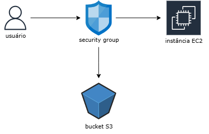

# Desafio 4 - Implementando Infraestrutura Automatizada com AWS CloudFormation

Nesse desafio foi pedido para aplicar os conceitos de Infraestrutura como Código (IaC) utilizando AWS CloudFormation e fazer anotações sobre. O objetivo é simular a criação, configuração e gerenciamento de recursos em nuvem de forma automatizada, segura e replicável, utilizando templates em YAML.

---

## 🎯 Objetivos

- Aplicar conceitos de IaC em um cenário prático;
- Criar templates reutilizáveis e padronizados;
- Documentar o processo técnico de forma clara.

---

## 📍 O que é IaC com AWS CloudFormation?

Infraestrutura como Código (IaC) é uma abordagem que permite definir e gerenciar recursos de TI por meio de arquivos de configuração legíveis por humanos. Com o AWS CloudFormation, é possível:

- Criar e configurar recursos como EC2, S3, RDS, VPC, etc;
- Automatizar o provisionamento com consistência;
- Reutilizar templates para replicar ambientes em diferentes regiões ou contas.

---

## 📁 Diagrama de Infraestrutura

O diagrama acima representa a estrutura simulada no template. Ele mostra:

- Um usuário acessando a instância EC2 por meio de um grupo de segurança;
- O grupo de segurança controlando o tráfego;
- Um bucket S3 conectado para armazenamento.

---

## 📝 Aprendizados

- Compreensão prática da estrutura de templates YAML.
- Aplicação de parâmetros para tornar o template flexível.
- Definição de recursos com foco em segurança e padronização.
- Organização de documentação técnica para reuso e estudo.
